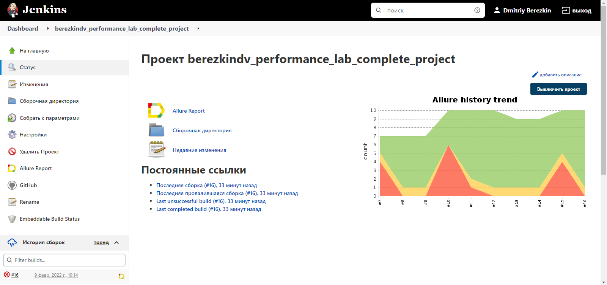
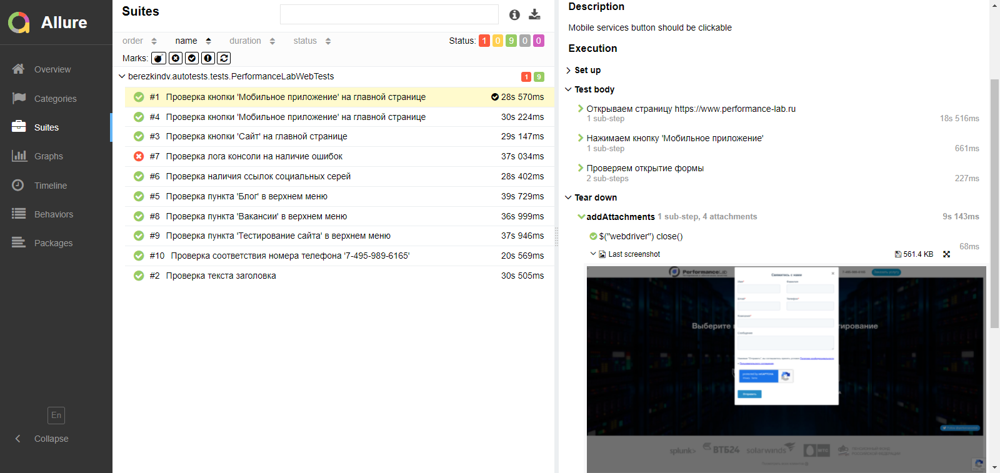
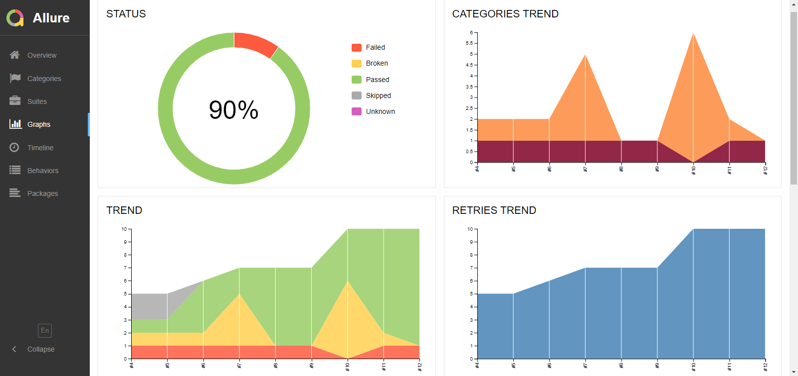
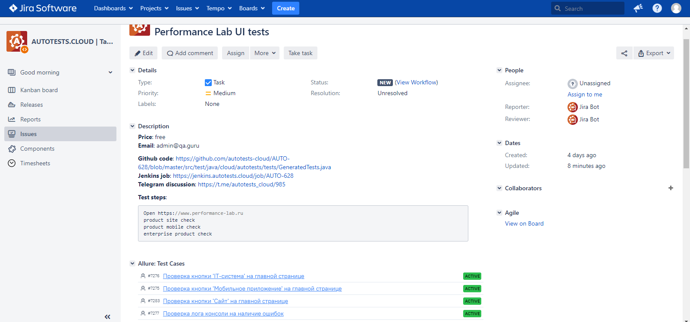
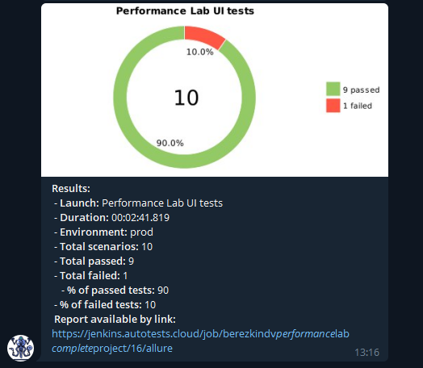
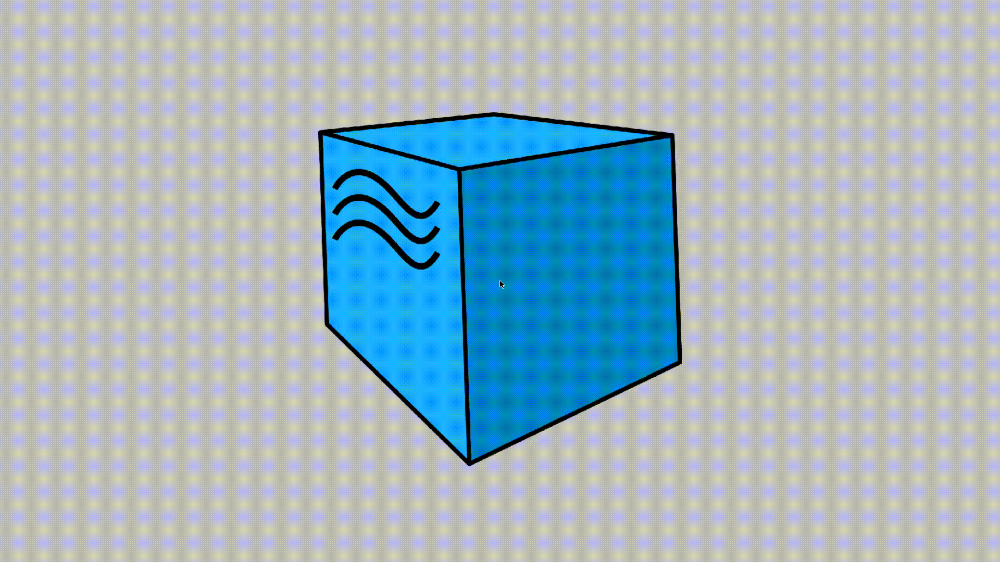

# Проект по автоматизации тестирования для сайта Nokian tyres
##### Сайт [NOKIAN TYRES][id]
[id]: https://www.nokiantyres.ru/
## :pushpin: Содержание:

- [Технологии и инструменты](#Технологии-и-инструменты)
- [Реализованные проверки](#Реализованные-проверки)
- [Сборка в Jenkins](#Jenkins-job)
- [Запуск из терминала](#Запуск-тестов-из-терминала)
- [Allure отчет](#Allure-отчет)
- [Интеграция с Allure TestOps](#Интеграция-с-Allure-TestOps)
- [Интеграция с Jira](#Интеграция-с-Jira)
- [Отчет в Telegram](#Уведомление-в-Telegram-при-помощи-бота)
- [Видео примеры прохождения тестов](#Примеры-видео-о-прохождении-тестов)

## :small_orange_diamond: Технологии и инструменты

<p align="center">
<a href="https://www.jetbrains.com/idea/"></a>
<a href="https://www.java.com/"></a>
<a href="https://github.com/"></a>
<a href="https://junit.org/junit5/"></a>
<a href="https://gradle.org/"></a>
<a href="https://selenide.org/"></a>
<a href="https://aerokube.com/selenoid/"></a>
<a href="https://github.com/allure-framework/allure2"></a>
<a href="https://www.jenkins.io/"></a>
</p>

## :small_orange_diamond: Реализованные проверки

- ✓ Проверка перехода на страницу информации о расширенной гарантии.
- ✓ Проверка перехода в https://marketplace.nokiantyres.ru/ со страницы "Расширенная гарантия".
- ✓ Проверка перехода на страницу активации расширенной гарантии.
- ✓ Проверка списка шин с бессрочной гарантией.
- - Параметризированные тесты:
- ✓ выбор шинных центров;
- ✓ выбор автосалонов.

## <a></a> Jenkins job
<a target="_blank" href="https://jenkins.autotests.cloud/job/performance_lab_complete_project/">Сборка в Jenkins</a>
<p align="center">
<a href="https://jenkins.autotests.cloud/job/performance_lab_complete_project/"></a>
</p>

### Параметры сборки в Jenkins:

- browser (браузер, по умолчанию chrome)
- browserVersion (версия браузера, по умолчанию 91.0)
- browserSize (размер окна браузера, по умолчанию 1920x1080)
- browserMobileView (название мобильного устройства, для примера iPhone X)
- remoteDriverUrl (логин, пароль и адрес удаленного сервера selenoid или grid)
- videoStorage (адрес, по которому можно получить видео)
- threads (количество потоков)

## :computer: Запуск тестов из терминала

Локальный запуск:
```bash
gradle clean test
```

Удаленный запуск:
```bash
clean
test
-Dbrowser=${BROWSER}
-DbrowserVersion=${BROWSER_VERSION}
-DbrowserSize=${BROWSER_SIZE}
-DbrowserMobileView="${BROWSER_MOBILE}"
-DremoteDriverUrl=https://${LOGIN}:${PASSWORD}@${REMOTE_DRIVER_URL}/wd/hub/
-DvideoStorage=https://${REMOTE_DRIVER_URL}/video/
-Dthreads=${THREADS}
```

## </a> Отчет в <a target="_blank" href="https://jenkins.autotests.cloud/job/performance_lab_complete_project/22/allure/">Allure report</a>

### Основное окно

<p align="center">

</p>

### Тесты

<p align="center">

</p>

### Гафики

<p align="center">

</p>

## </a>Интеграция с <a target="_blank" href="https://allure.autotests.cloud/launch/10223">Allure TestOps</a>

### Дашборд

<p align="center">

</p>

### Тест-кейсы

<p align="center">

</p>

## </a>Интеграция с трекером задач <a target="_blank" href="https://jira.autotests.cloud/browse/AUTO-628">Jira</a>

<p align="center">

</p>

## </a> Уведомление в Telegram при помощи бота

<p align="center">

</p>


### </a> Примеры видео о прохождении тестов

<p align="center">
  
</p>
