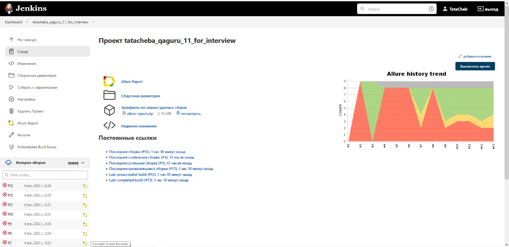
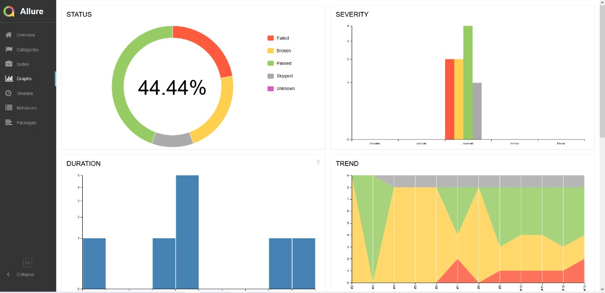
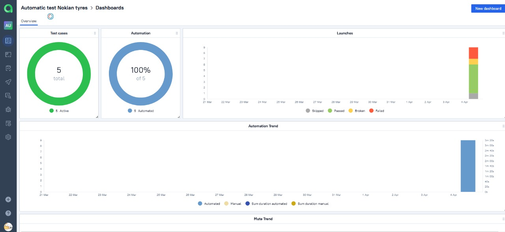

# Проект по автоматизации тестирования для сайта Nokian tyres
#####  :arrow_right: Сайт [NOKIAN TYRES][id] :arrow_left:
[id]: https://www.nokiantyres.ru/

## :page_with_curl:	Содержание

> :heavy_check_mark: [Технологии и инструменты](#technologist-технологии-и-инструменты)
>
> :heavy_check_mark: [Реализованы проверки](#bookmark_tabs-реализованы-проверки)
>
> :heavy_check_mark: [Запуск тестов из терминала](#computer-Запуск-тестов-из-терминала)
>
> :heavy_check_mark: [Запуск тестов в Jenkins](#-запуск-тестов-в-jenkins)
>
> :heavy_check_mark: [Отчет о результатах тестирования в Allure Report](#-отчет-в-allure-report)
>
> :heavy_check_mark: [Интеграция с Allure TestOps](#-Интеграция-с-Allure-TestOps)
> 
> :heavy_check_mark: [Интеграция с Jira](#-интеграция-с-jira)
>
> :heavy_check_mark: [Уведомления в Telegram с использованием бота](#-уведомления-в-telegram-с-использованием-бота)
>

## :technologist: Технологии и инструменты

<p align="center">
<a href="https://www.jetbrains.com/idea/"></a>
<a href="https://www.java.com/"></a>
<a href="https://github.com/"></a>
<a href="https://junit.org/junit5/"></a>
<a href="https://gradle.org/"></a>
<a href="https://selenide.org/"></a>
<a href="https://aerokube.com/selenoid/"></a>
<a href="https://github.com/allure-framework/allure2"></a>
<a href="https://www.jenkins.io/"></a>
</p>

> *В данном проекте автотесты написаны на <code><strong>*Java*</strong></code> с использованием фреймворка <code><strong>*Selenide*</strong></code> для UI-тестов.*
>
>*Для сборки проекта используется <code><strong>*Gradle*</strong></code>.*
>
>*<code><strong>*JUnit 5*</strong></code> используется как фреймворк для модульного тестирования.*
>
>*Запуск тестов выполняется из <code><strong>*Jenkins*</strong></code>.*
>
>*<code><strong>*Selenoid*</strong></code> используется для запуска браузеров в контейнерах  <code><strong>*Docker*</strong></code>.*
>
>*<code><strong>*Allure Report, Allure TestOps, Jira, Telegram Bot*</strong></code> используются для визуализации результатов тестирования.*

## :bookmark_tabs: Реализованы проверки

* ✓ Проверка перехода на страницу информации о расширенной гарантии.
* ✓ Проверка перехода в https://marketplace.nokiantyres.ru/ со страницы "Расширенная гарантия".
* ✓ Проверка перехода на страницу активации расширенной гарантии.
* ✓ Проверка списка шин с бессрочной гарантией.
* Параметризированные тесты:
    * ✓ выбор шинных центров;
    * ✓ выбор автосалонов.
    

## :computer: Запуск тестов из терминала

Локальный запуск:
```bash
gradle clean test
```

Удаленный запуск:
```bash
gradle
clean
test
-Dbrowser=${BROWSER}
-Dversion=${VERSION}
-Dsize=${BROWSER_SIZE}
-Durl=${REMOTE_URL}
```

### Параметры сборки

> <code>BROWSER</code> – браузер, в котором будут выполняться тесты (_по умолчанию - <code>chrome</code>_).
>
> <code>VERSION</code> – версия браузера, в которой будут выполняться тесты (_по умолчанию - <code>91.0</code>_).
>
><code>BROWSER_SIZE</code> – размер окна браузера, в котором будут выполняться тесты (_по умолчанию - <code>1920x1080</code>_).
>
> <code>REMOTE_URL</code> – адрес удаленного сервера, на котором будут запускаться тесты.
>

##  Запуск тестов в [Jenkins](https://jenkins.autotests.cloud/job/tatacheba_qaguru_11_for_interview)


<p align="center">
  
</p>


## </a> Отчет в <a target="_blank" href="https://jenkins.autotests.cloud/job/tatacheba_qaguru_11_for_interview/allure">Allure report</a>

### Основное окно

<p align="center">

</p>

### Тесты

<p align="center">

</p>

### Графики

<p align="center">

</p>

### </a> Пример видео о прохождении тестов

<p align="center">
 
</p>

##  Интеграция с [Allure TestOps](https://allure.autotests.cloud/project/1199/)

### Dashboards
<p align="center">

</p>

### Test cases
<p align="center">

</p>

##  Интеграция с [Jira](https://jenkins.autotests.cloud/job/tatacheba_qaguru_11_for_interview)

<p align="center">

</p>

##  Уведомление в Telegram при помощи бота

<p align="center">

</p>


