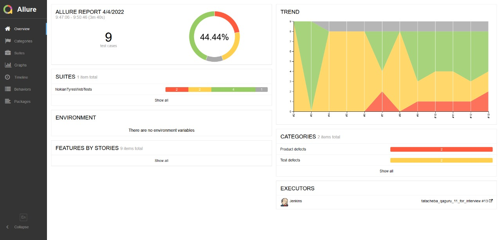
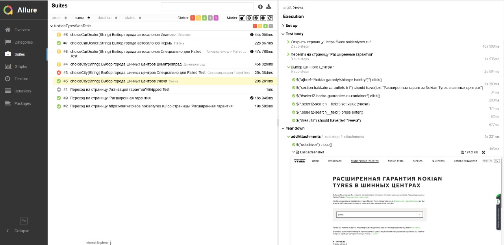
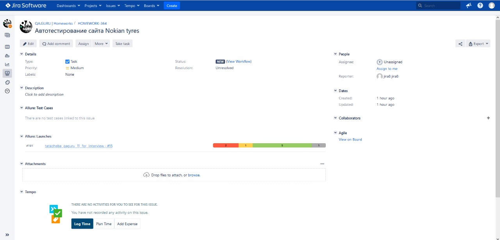
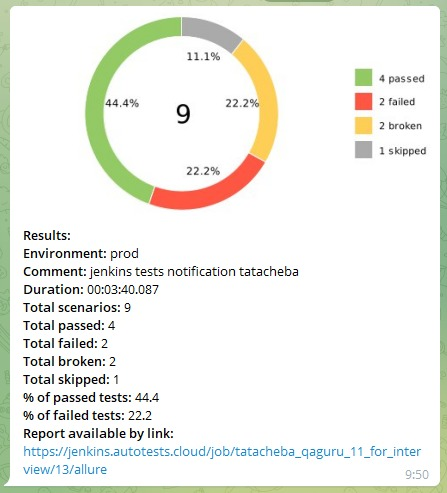

# UI-testing automation project for Nokian tyres

##### :arrow_right: website [NOKIAN TYRES][id] :arrow_left:

[id]: https://www.nokiantyres.ru/

## :page_with_curl: Contents

> :heavy_check_mark: [Technologies and tools](#technologist)
>
> :heavy_check_mark: [Verified checks](#verified)
>
> :heavy_check_mark: [Run tests from the terminal](#computer)
>
> :heavy_check_mark: [Running Tests in Jenkins](#running_tests)
>
> :heavy_check_mark: [Report on test results in Allure Report](#report_allure_report)
>
> :heavy_check_mark: [Integration with Allure TestOps](#integration_allure_testops)
>
> :heavy_check_mark: [Integration with Jira](#integration_jira)
>
> :heavy_check_mark: [Notifications in Telegram using a bot](#notifications_telegram_bot)

## <a name="technologist"> Technologies and tools</a>

<p align="center">
<a href="https://www.jetbrains.com/idea/"></a>
<a href="https://www.java.com/"></a>
<a href="https://github.com/"></a>
<a href="https://junit.org/junit5/"></a>
<a href="https://gradle.org/"></a>
<a href="https://selenide.org/"></a>
<a href="https://aerokube.com/selenoid/"></a>
<a href="https://github.com/allure-framework/allure2"></a>
<a href="https://www.jenkins.io/"></a>
</p>

> *In this project, automated tests are written in <code><strong>*Java*</strong></code> using <code><strong>*Selenide*</strong></code> framework for UI testing.*
>
> _<code><strong>*Gradle*</strong></code> is used for project building._
>
> *<code><strong>*JUnit 5*</strong></code> is utilized as the framework for unit testing.*
>
> *Test execution is performed from <code><strong>*Jenkins*</strong></code>.*
>
> *<code><strong>*Selenoid*</strong></code> is used for running browsers in <code><strong>*Docker*</strong></code>.*
>
> *<code><strong>*Allure Report, Allure TestOps, Jira, Telegram Bot*</strong></code> are employed for visualizing test results.*

## <a name="verified">Verified checks</a>

-   ✓ Verifying the transition to the advanced guarantee information page.
-   ✓ Checking the transition from the page "Advanced Guarantee" to https://marketplace.nokiantyres.ru/
-   ✓ Check the Advanced Guarantee Activation Page.
-   ✓ Check list of tyres with indefinite warranty.
-   Parametrized tests:
    -   ✓ Bus center selection;
    -   ✓ Showroom selection.

## <a name="computer">Run tests from the terminal</a>

Local start:

```bash
gradle clean test
```

Remote start:

```bash
gradle
clean
test
-Duser=${USER}
-Dpassword=${PASSWORD}
```

## <a name="running_tests">Running Tests in [Jenkins](https://jenkins.autotests.cloud/job/tatacheba_qaguru_11_for_interview)</a>

<p align="center">
  
</p>

## <a name="report_allure_report"> Report on test results in <a target="_blank" href="https://jenkins.autotests.cloud/job/tatacheba_qaguru_11_for_interview/allure">Allure report</a> </a>

### Main

<p align="center">

</p>

### Tests

<p align="center">

</p>

### Graphics

<p align="center">

</p>

### </a> Example video about passing tests

<p align="center">
 
</p>

##  <a name="integration_allure_testops">Integration with [Allure TestOps](https://allure.autotests.cloud/project/1199/)</a>

### Dashboards

<p align="center">

</p>

### Test cases

<p align="center">

</p>

## <a name="integration_jira">Integration with [Jira](https://jenkins.autotests.cloud/job/tatacheba_qaguru_11_for_interview)</a>

<p align="center">

</p>

##  <a name="notifications_telegram_bot">Notifications in Telegram using a bot</a>

<p align="center">

</p>
